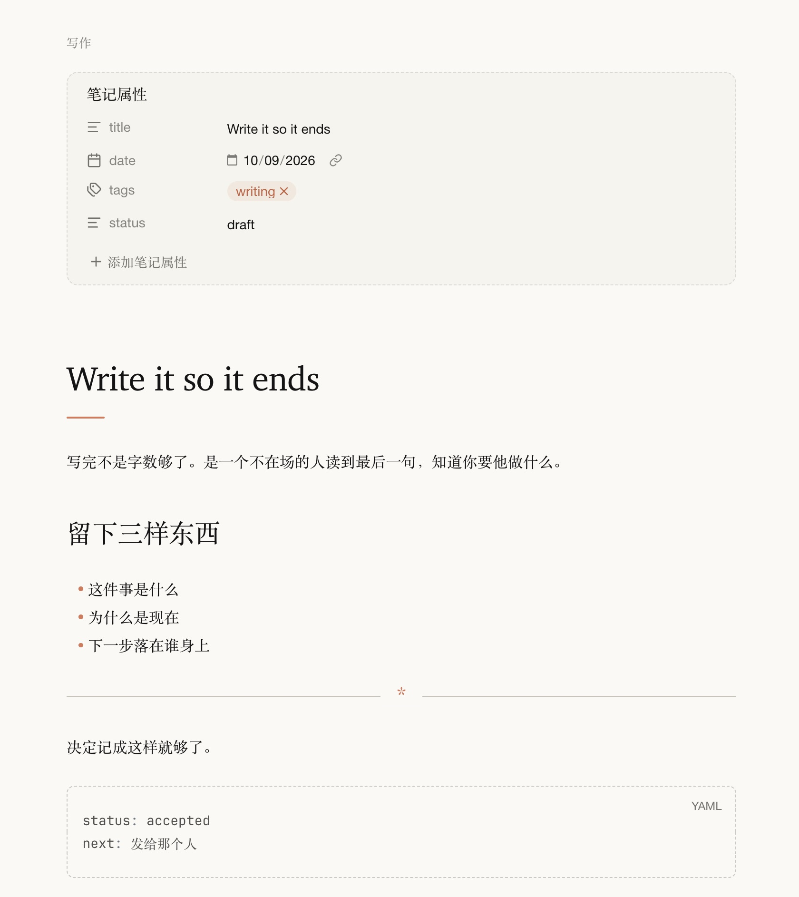

# Claudette



Obsidian 主题。象牙底、居中正文栏、陶土色点缀。风格致敬，不是 Anthropic 官方主题。

## 安装

把这个仓库放到库的 `.obsidian/themes/Claudette`，然后在外观里启用 Claudette。

```bash
git clone https://github.com/xinnyu/obsidian-claudette.git \
  "<vault>/.obsidian/themes/Claudette"
```

## 字体

仓库里没有字体文件。英文会先找本机已安装的 Anthropic Serif、Anthropic Sans、Anthropic Mono；没有就用 Charter、Helvetica Neue、JetBrains Mono。汉字用 Songti SC。

## 许可

CSS 是 MIT。Anthropic 的字体不在这里，版权归字体权利人。
